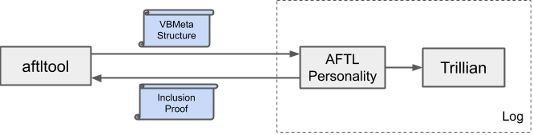
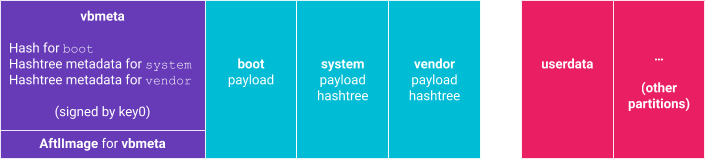
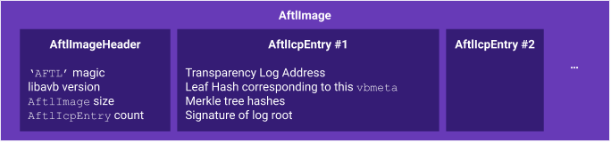
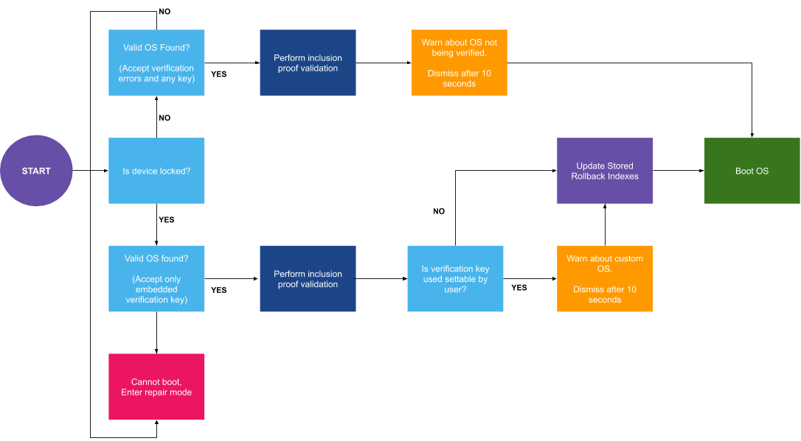

# Android Firmware Transparency Log 1.0
---

This repository contains tools and libraries for working with the Android
Firmware Transparency Log components of Android Verified Boot. AFTL will be
used to refer to these components.

[TOC]

# What is it?

The Android Firmware Transparency Log (AFTL) is an implementation of binary
transparency that leverages cryptographic proofs of inclusion of build images
using a public append-only ledger. The device manufacturer stores these
cryptographic proofs, called inclusion proofs, on-device to allow for offline
validation of the build during system update and device boot. This ensures that
only a publicly known build is running on the device. Furthermore, it allows
device manufacturers and other interested parties to audit the information in
the log to detect unexpected or malicious uses of the publisher's signing keys.


## System overview

An AFTL can be implemented using a
[Trillian](https://github.com/google/trillian) instance which manages a Merkle
tree with build metadata (particularly the [VBMeta
struct](https://android.googlesource.com/platform/external/avb/+/refs/heads/master#The-VBMeta-struct))
and keeps a repository of other data that were made transparent.



As part of the finalizing step in the build process the `aftltool` reaches out
to the **AFTL personality** to submit a manufacturer-signed message (containing
VBMeta struct and other metadata) to the AFTL. Then the AFTL personality
submits that data to Trillian to incorporate it into the Merkle tree. After
integration into the log, the AFTL personality returns the inclusion proof back
to the `aftltool`, which in turn incorporates the inclusion proof with the
VBMeta image.

The AFTL uses two sets of keys for authentication and validation, the
transparency log key and the manufacturer key.

* **Transparency log key:** Used by Trillian to sign inclusion proofs. The
  public key is embedded with the device for on-device for validation.
* **Manufacturer key:** Used by OEMs or other build providers to sign
  submissions sent to the log. This ensures that malicious entries posing as a
  valid OEM entry cannot be provided to the log. For the log to authenticate
  messages, the manufacturer key must be shared out-of-band with the AFTL prior
  to submission.

## The AftlImage struct

The central data structure used for AFTL validation is the `AftlImage` struct.
The structure is saved on the vbmeta partition, right after the
`AvbVBMetaImage` struct, as illustrated below.



This structure contains the `AftlImageHeader` header that describes the number
of inclusion proofs (`AftlIcpEntry`) represented by this structure. Each
inclusion proof has associated metadata, such as the transparency log URL. A
high-level description of the structures is given below. See
[aftltool](https://android.googlesource.com/platform/external/avb/+/refs/heads/master/aftltool.py)
and
[libavb_aftl](https://android.googlesource.com/platform/external/avb/+/refs/heads/master/libavb_aftl/)
for more details.




Each `AftlIcpEntry` structure contains the information required to validate an
inclusion proof from a specific transparency log server for a given [VBMeta
structure](https://android.googlesource.com/platform/external/avb/+/master#the-vbmeta-struct)
given the corresponding transparency log public key. The inclusion proof
validation process is described in the [inclusion proofs](#inclusion-proofs)
section of this document.

*Note*: A single `AftlImage` can have multiple inclusion proofs from different
transparency logs. This allows the device manufacturer to not rely on a single
transparency log, and ensures that the builds represented by the VBMeta
structure are deemed transparent in multiple disparate jurisdictions.

## Inclusion proofs

An inclusion proof allows a user to prove that a specific VBMeta structure is
included in a transparency log. An inclusion proof consists of three parts:

*  A `SignedVBMetaPrimaryAnnotation` structure containing the hash of the
VBMeta structure (and other build meta information) that is signed with the
manufacturer key.
*  A set of sibling node hashes (`Proof`) in a Merkle tree on the path from the
leaf node in question, which represents the logged annotation, to the root
node.
*  A `TrillianLogRootDescriptor` structure containing the log's root hash,
along with related metadata, which is signed by the transparency log’s private
key.

Validation of an inclusion proof can be performed with the following steps,
which are implemented in both `aftltool` and `libavb_aftl`.

1.  Calculate the hash of the VBMeta structure stored on the device.
1.  Determine if the hash matches the hash stored in the
`SignedVBMetaPrimaryAnnotation` structure inside the `AftlImage` on device. If
it does, continue validation.
1.  Given the set of hashes provided from the transparency log as part of the
inclusion proof, attempt to recalculate the root hash. Details of the process
can be found [here](https://www.certificate-transparency.org/log-proofs-work)
in the Merkle Audit Proofs section.
1.  Check the calculated root hash against the log's root hash from the
inclusion proof. If it matches, continue validation.
1.  Finally, verify the log root signature given the calculated root hash and
the public key of the transparency log that is stored on device. If the
signature is valid, the inclusion proof is valid.

# Tools and libraries

This section contains information about the tools and libraries added to AVB
repository or modified to include AFTL support.

## aftltool and libavb\_aftl

The main purpose of
[aftltool](https://android.googlesource.com/platform/external/avb/+/refs/heads/master/aftltool.py)
is to add an inclusion proof to an existing `vbmeta.img` to be used
for transparency checks at boot or system update time. This enhanced image is
stored in the `vbmeta` partition or in the `vbmeta_a` and
`vbmeta_b` slots when using A/B  and will still be of minimal size
(for out-of-band updates). Creation, query, and verification tasks can be
performed with `aftltool`.

In addition to the `aftltool`, the
[libavb](https://android.googlesource.com/platform/external/avb/+/master/libavb/)
library comes with an extension called
[libavb\_aftl](https://android.googlesource.com/platform/external/avb/+/master/libavb_aftl/).
This component performs all verification on the device side related to AFTL and
inclusion proofs. That is, it loads the `vbmeta` partition, checks
the VBMeta structure signature, walks through each inclusion proof stored in
the `AftlImage`, and validates them against a trusted transparency
log key stored on the device.

This library is intended to be used in both the boot loader and inside Android
as part of the OTA client. The main entry point for verification is
`aftl_slot_verify()`, which is intended to be called after `vbmeta`
verification is done via `avb_slot_verify()`.

## Files and directories

* `libavb_aftl/`
  + An implementation of AFTL inclusion proof validation. This
    code is designed to be highly portable so it can be used in as many contexts
    as possible. This code requires a C99-compliant C compiler. Only the content
    declared in `libavb_aftl.h` is considered public. The other files are
    considered internal to the implementation and may change without notice.
* `libavb_aftl/README.md`
  + This document.
* `test/`
  + Unit tests for `libavb_aftl.`
* `test/data/`
  + Test data for the `aftltool` and `libavb_aftl` unit tests.
* `aftltool`
  + A symlink to `aftltool.py`.
* `aftltool.py`
  + A tool written in Python for working with images related to AFTL.
* `Android.bp`
  + Build rules for `aftltool`,  `libavb_aftl` (a static library
    for use on the device), host-side libraries (for unit tests), and unit
    tests.
* `aftltool_test.py`
  + Source-code for `aftltool` related unit tests.
* `aftltool_integration_test.py`
  + Source-code for `aftltool` related integration tests against
    a live transparency log.

## Portability

The `libavb_aftl` code is intended to be used in bootloaders in devices that
will load Android or other operating systems. The suggested approach is to copy
the appropriate header and C files mentioned in the previous section into the
boot loader and integrate as appropriate. The library is intended to be highly
portable, working on both little and big endian architectures, as well as
32-bit and 64-bit variants of each. It is also intended to work in environments
without the standard C library and runtime.

As in libavb, if the `AVB_ENABLE_DEBUG` preprocessor symbol is set, the code
will include useful debug information and run-time checks.

## Versioning and compatibility

The `libavb_aftl` library follows the [versioning of
libavb](https://android.googlesource.com/platform/external/avb/+/master#Versioning-and-Compatibility).

## Using aftltool

The content for the vbmeta partition is assumed to have been generated
previously using `avbtool`. Instructions can be found in the
[README.md](https://android.googlesource.com/platform/external/avb/+/master/README.md)
for libavb. After the VBMeta partition is generated, it can be extended with
inclusion proofs from transparency logs in the following manner:


```
aftltool make_icp_from_vbmeta \
      --vbmeta_image_path /path/to/image.bin \
      --output OUTPUT \
      [--signing_helper /path/to/external/signer]  \
      [--signing_helper_with_files /path/to/external/signer_with_files] \
      --version_incremental STR \
      --transparency_log_servers host:port,/path/to/log_key.pub \
      --manufacturer_key /path/to/priv_key \
      [--padding_size NUM]
```

The
[version\_incremental](https://developer.android.com/reference/android/os/Build.VERSION#INCREMENTAL)
is a part of the build fingerprint which allows for tagging the transparency
log entry for easier tracking.

An example of how to use the `make_icp_from_vbmeta` command is as follows:

```
aftltool make_icp_from_vbmeta \
      --vbmeta_image_path ./vbmeta.img \
      --output ./vbmeta_icp.img \
      --version_incremental 99999999 \
      --transparency_log_servers \
        log.aftl-android.com:9000,/aftl-log-rsa-pub.pem \
      --manufacturer_key ./manufacturer-rsa.pem \
      --algorithm SHA256_RSA4096 \
      --padding 4096
```

The AFTL information can be viewed in a human readable format in the following
manner:

```
aftltool info_image_icp \
      --vbmeta_image_path /path/to/image.bin \
      [--output OUTPUT]
```

An example using `info_image_icp` is as follows:

```
aftltool info_image_icp --vbmeta_image_path ./vbmeta.img
```

Verification of an AFTL enhanced vbmeta image can be performed with the
following command:

```
aftltool verify_image_icp \
      --vbmeta_image_path /path/to/image.bin \
      --transparency_log_pub_keys [TRANSPARENCY_LOG_PUB_KEYS [TRANSPARENCY_LOG_PUB_KEYS ...]] 
[--output OUTPUT]
```

An example using `verify_image_icp` is as follows:

```
aftltool verify_image_icp --vbmeta_image_path ./vbmeta.img --transparency_log_pub_keys ./log_pub_key.pem
```

More information on the options can be found using `aftltool --help`.

# Build system integration

AFTL modifications only will work if AVB is enabled in the build. In Android,
AVB is enabled in an `Android.mk` file by the `BOARD_AVB_ENABLE` variable as
described in the AVB
[README.md](https://android.googlesource.com/platform/external/avb/#Build-System-Integration).

When calling the
[sign\_target\_files\_apks.py](https://android.googlesource.com/platform/build/+/master/tools/releasetools/sign_target_files_apks.py)
script, the following parameters must be set:

*  `--aftl_tool_path`, the location of aftltool.py
*  `--aftl_server`, the address of the transparency log
*  `--aftl_key_path`, which gives the path to the DER encoded transparency log public key
*  `--aftl_manufacturer_key_path`, which gives the path to the DER encoded OEM
  private key. Note: This key is different to the signing key used to sign VBMeta
  structure

Remember that the public part of the transparency log keys need to be available
to the bootloader of the device to validate the inclusion proofs.

# Device integration

This section discusses recommendations and best practices for integrating
`libavb` AFTL support with a device boot loader. It's important to emphasize
that these are just recommendations. Most of these recommendations are the same
as those for AVB.

## Recommended bootflow

The boot flow should ensure checking of the inclusion proofs independent of the
unlock state of the device. It is recommended to present the user with a
warning in case transparency checks fail.

AFTL modifies this flow in the following manner: as soon as a valid OS has been
found, search for an `AftlImage` for each VBMeta image and validate their
inclusion proofs (this is done by the `aftl_slot_verify` function). The result
of the verification can be appended to the kernel command line for further
processing by the OS.


